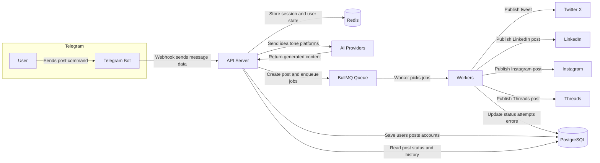
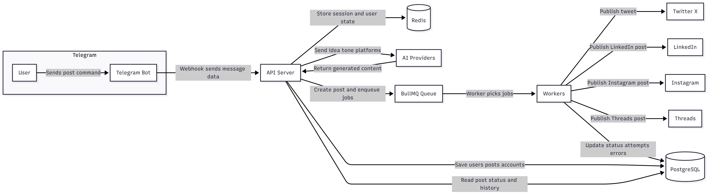

# Architecture

## Overview

Postly is a modular backend for generating social content with AI, coordinating multi-platform publishing through a Telegram-first workflow.

Core runtime pieces:

- Express API server for HTTP endpoints and Telegram webhook handling
- Prisma ORM with PostgreSQL for persistent application data
- Redis for Telegram conversation state and BullMQ queue storage
- BullMQ workers for asynchronous platform publishing
- grammY Telegram bot for the conversational publishing flow
- AI provider adapters for OpenAI, Anthropic, and OpenRouter

The design goal is to keep the API stateless where possible, push slow publishing work into queues, and preserve enough state to recover from retries or partial failures.

## System Diagram

## Workflow
Telegram User
   ↓
Telegram Bot Webhook
   ↓
API Server
   ↓
Redis stores Telegram session
   ↓
AI generates content
   ↓
User confirms
   ↓
API creates Post and PlatformPost rows
   ↓
BullMQ jobs added in Redis
   ↓
Workers pick jobs
   ↓
Social platform APIs
   ↓
DB status updated
   ↓
User sees final status
## Telegram to Platform Data Flow

### 1. Session start

The user begins in Telegram with `/start <user_id>` or `/post`.

The bot:

- validates the Telegram webhook request
- creates or loads a Redis session keyed by `telegram_session:{chatId}`
- stores the linked internal `userId`
- keeps the conversation step so the user can continue without restarting

### 2. Conversation collection

The bot collects the minimum publish inputs in sequence:

- post type
- one or more platforms
- tone
- AI model
- idea or core message

The state lives in Redis until the user confirms or the session expires.

### 3. AI generation

After the idea is provided, the bot calls the content generation service.

That service:

- selects an AI client based on the chosen model
- resolves the correct API key from user storage or environment variables
- sends a prompt that asks for structured JSON per platform
- parses and validates the model response
- returns platform-specific previews plus warnings when content violates soft constraints

### 4. Publish request

When the user taps `Yes, Post Now`, the bot calls the publish endpoint.

The API then:

- creates a `Post` row
- creates one `PlatformPost` row per selected platform
- marks the post as `PROCESSING` or `SCHEDULED` depending on execution mode
- enqueues one BullMQ job per platform

### 5. Worker execution

Workers consume the queue and publish each platform independently.

For each job, a worker:

- loads the `Post` and matching `PlatformPost`
- loads the connected social account for the platform
- calls the platform publisher adapter
- marks success or failure on the `PlatformPost`
- recomputes the overall `Post` status

This allows one platform to succeed while another fails, instead of failing the entire post atomically.

## Redis Session Design

Redis is used for Telegram conversation state, not as the source of truth for business records.

Key design choices:

- Session key format: `telegram_session:{chatId}`
- Data stored: step, userId, selected post type, selected platforms, selected tone, model, idea, preview data, timestamps
- TTL: 30 minutes of inactivity
- Refresh behavior: each read extends the TTL so an active conversation stays alive

Why Redis:

- fast read/write for interactive messaging
- easy expiry for abandoned conversations
- keeps Telegram handlers stateless across server restarts when Redis is persistent

Trade-off:

- Redis eviction policy matters. For BullMQ and session stability, `noeviction` is preferred over memory-based eviction policies.

## Database Schema Decisions

### Why `posts` and `platform_posts` are separate

The schema models one user-facing post with multiple per-platform children:

- `posts` stores the logical post request, metadata, and overall status
- `platform_posts` stores one generated/published item per platform

This separation gives:

- independent retries per platform
- precise failure reporting
- granular status tracking
- simpler audit/history per network

### Why encrypted key storage is separate

The `ai_keys` table stores encrypted provider keys per user:

- `openaiKeyEnc`
- `anthropicKeyEnc`
- `openrouterKeyEnc`

These values are encrypted with AES-256-GCM using the server `ENCRYPTION_KEY`.

This approach keeps provider credentials out of plain text while still allowing user-specific model fallback.

### Why social accounts are separate

Connected social accounts are stored independently in `social_accounts` so publishing can:

- find the correct OAuth tokens per platform
- support one account per platform per user
- rotate or reconnect a single platform without affecting others

## Index Strategy

The schema uses a small set of targeted indexes to match the API access patterns.

### User lookup

- `users.email` unique index for register/login lookup

### Token management

- `refresh_tokens.token_hash` unique index for token rotation and revocation checks
- `refresh_tokens.user_id` for user token cleanup

### Social account lookup

- `social_accounts.user_id` for all connected accounts for a user
- `social_accounts.platform` for per-platform account lookup
- unique `(user_id, platform)` to enforce one account per platform per user

### Post history and filtering

- `posts.user_id` for per-user history
- `posts.status` for filtering active/failed/completed posts
- `posts.publish_at` for scheduled publishing views
- composite `(user_id, status)` for dashboard-style querying

### Platform post lookup

- `platform_posts.post_id` to load all platform children for a post
- `platform_posts.platform` for platform-specific access
- `platform_posts.status` for retry and monitoring workflows
- unique `(post_id, platform)` to prevent duplicate platform rows

## Partial Failure Handling

Partial failure is a normal path in this system, not an exception.

Examples:

- AI output may be valid JSON but still violate character or hashtag guidance
- a single platform may fail while others succeed
- a worker may retry and then permanently fail after exhausting attempts

How it is handled:

- validation issues are returned as warnings instead of hard failures when possible
- BullMQ retries use backoff to avoid immediate repeated failures
- the worker writes `errorMessage`, `status`, and attempt counts back to `platform_posts`
- the parent `posts` status is recomputed from child states

Common parent statuses:

- `PUBLISHED` when all platform posts succeed
- `PARTIALLY_PUBLISHED` when some succeed and some fail
- `FAILED` when all platform posts fail
- `PROCESSING` while jobs are still running

## Trade-offs

### Telegram webhook instead of polling

Pros:

- lower latency
- better production scalability
- one public endpoint to manage

Cons:

- requires HTTPS and correct webhook secret handling
- depends on external delivery from Telegram

### Redis-backed sessions

Pros:

- simple conversational state management
- automatic expiry for abandoned flows
- easy to scale horizontally

Cons:

- Redis availability becomes user-facing for bot interactions
- eviction policy must be compatible with queues and sessions

### Separate per-platform jobs

Pros:

- platform-specific retries
- better observability
- partial success is possible

Cons:

- more job bookkeeping
- slightly more database and queue overhead

### Encrypted provider keys

Pros:

- user-specific AI fallback support
- less dependence on one global key set

Cons:

- secret rotation must be managed carefully
- the server must always have a valid `ENCRYPTION_KEY`

## Operational Notes

- The API starts the Telegram bot and workers during normal server bootstrap.
- The Telegram webhook route is `/api/bot/telegram/webhook/:secret`.
- The bot should only be considered healthy if it can respond to `/help`, step through `/post`, and complete a preview flow.
- For production, set `NODE_ENV=production`, `TELEGRAM_WEBHOOK_URL`, `TELEGRAM_WEBHOOK_SECRET`, and a valid `DATABASE_URL` and Redis config.
